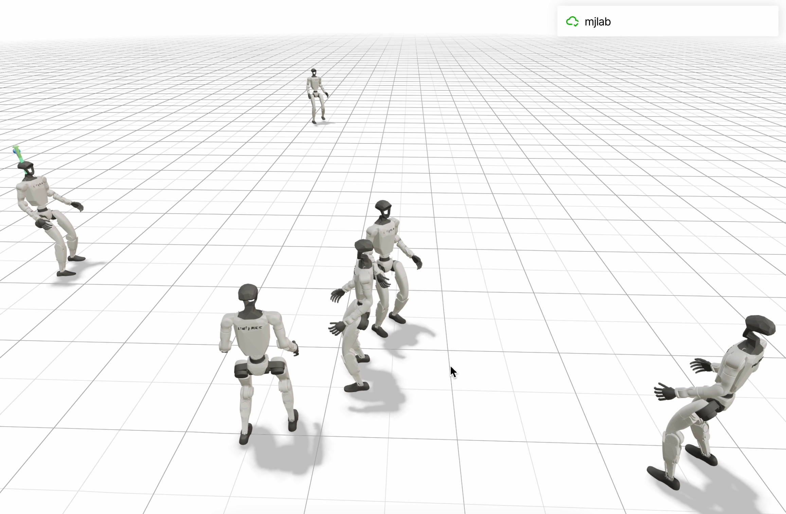

# Clinical Trial Drug Infusion Room - RL Training Package

## Videos: [50 Iterations](https://drive.google.com/drive/folders/1pwc8j8XeNDL6_M4BnhbrU91dj9PzG0tH?usp=drive_link), [3000 Iterations](https://drive.google.com/drive/folders/16_cxfCgOeL4ncXgi-wubAzRiHwoAM5TL?usp=drive_link), [1500 Iterations (New)](https://drive.google.com/drive/folders/19OeOJfr3_lVvdqVarpspYcppDERj5_s4?usp=drive_link)  

<picture>
  
</picture>

## Session Information
- **Session ID**: 20260122_185241
- **Date**: 2026-01-22 18:59:53
- **Framework**: mjlab (MuJoCo-Warp)
- **Hardware**: NVIDIA L4, H100, T4

## Package Contents

```
clinical_trial_outputs/
├── checkpoints/          # PyTorch model checkpoints (.pt)
├── onnx/                 # ONNX models for deployment
├── tensorboard/          # TensorBoard log files
├── charts/               # Visualization outputs
│   ├── training_analysis.png
│   └── interactive_dashboard.html
├── configs/              # Training configurations
├── training_logs/        # Raw training output logs
├── logs/                 # Additional logs
└── sim2real_deployment_guide.json
```

## Trained Policies

| Policy | Context | ONNX File | Recommended Use |
|--------|---------|-----------|----------------|
| Careful Navigation | IV equipment navigation | careful_navigation_policy.onnx | Obstacle-rich areas |
| Patient Approach | Approaching patient beds | patient_approach_policy.onnx | Near patients |
| Equipment Transport / Dynamic Environment | Carrying infusion pumps | equipment_transport_policy.onnx | Transporting equipment |

## Quick Start

### Sim-to-Sim Evaluation (Mac/Linux)
```bash
# Clone mjlab
git clone https://github.com/mujocolab/mjlab.git
cd mjlab && uv sync

# Run evaluation
uv run play Mjlab-Velocity-Flat-Unitree-G1 \
    --checkpoint /path/to/checkpoints_3000/careful_navigation_model_2999.pt \
    --num-envs 6

# View at http://localhost:8080
```

### Sim-to-Real Deployment
See `sim2real_deployment_guide.json` for complete instructions.

### TensorBoard Visualization
```bash
tensorboard --logdir ./tensorboard
```

## License
Apache 2.0

[](https://doi.org/10.5281/zenodo.18343597)
